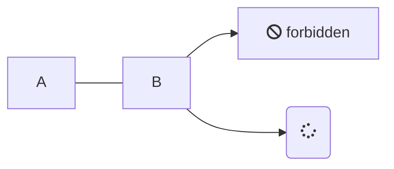

<!-- tabs:start -->

<!-- tab:English -->

Hello!

<!-- tab:French -->

Bonjour!

<!-- tab:Italian -->

dgfhg <span class="tab-badge">New!</span>

<!-- tabs:end -->

<!-- panels:start -->
<!-- div:floating-cat -->

(...) - Awesome div wrapper

<!-- panels:end -->

<!-- select:start -->
<!-- select-menu-labels: Operating System -->

Common content can go here above the first heading in a section and be rendered for all selections!

#### --macOS--

macOS instructions here

#### --Linux--

Linux instructions here

<!-- select:end -->

# Default Slide

Here is what a default slide looks like.

There are two sections, and they both have 50% of the page width.


<!-- slide:break -->

# 

I have added:

```
<!-- slide:break -->
```

in my markdown to separate these two sections.



